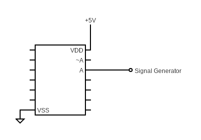
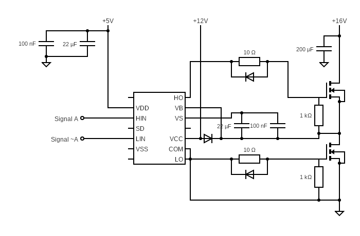
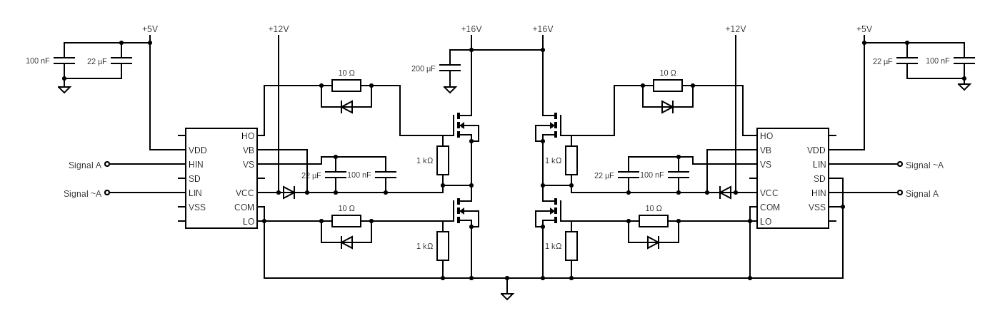
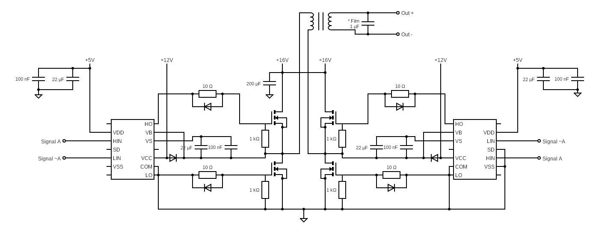
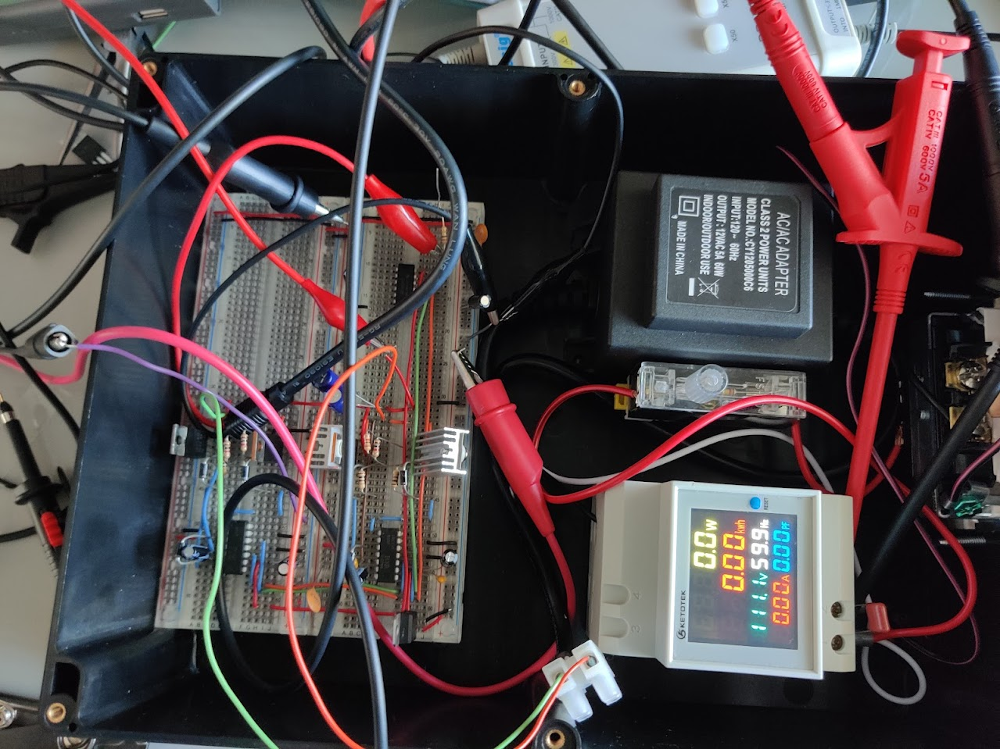
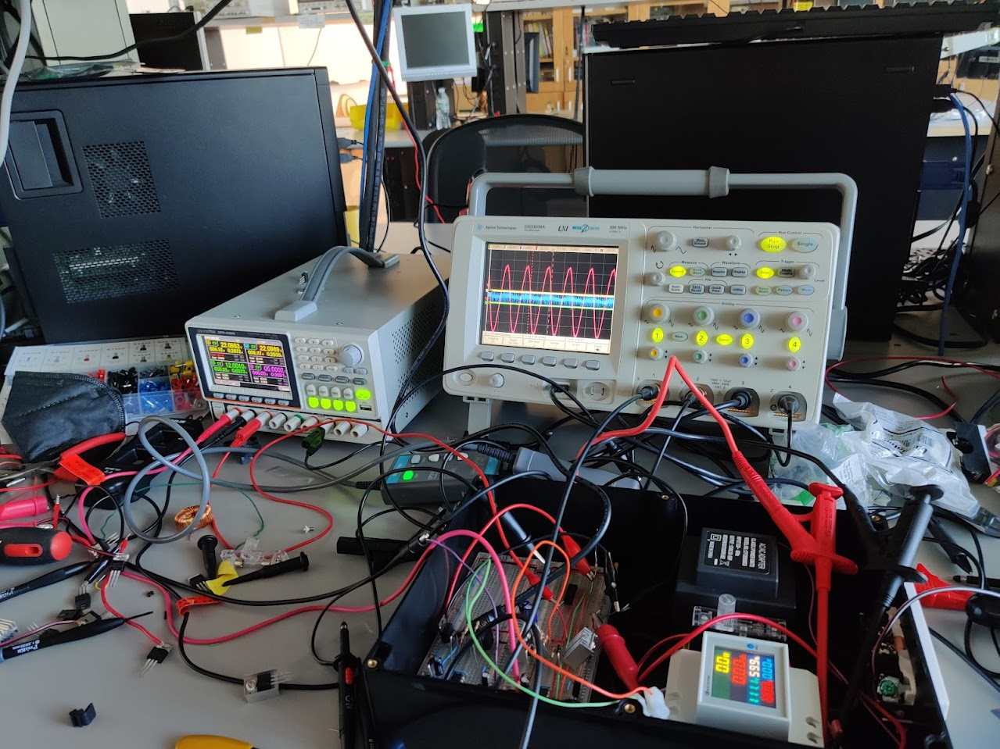

# How to build a Power Inverter
By Daniel Mezhiborsky, Jaewon Cho, and Gavri Kepets
## Introduction - What is an Inverter?
An inverter is a power electronics device that can convert direct current to alternating current. Inverters can be used for numerous different things; a common application of an inverter is to deliver high voltage AC signals to the outlets in a house, for example. For this project, a full bridge inverter was successfully built and used to supply AC power to an outlet, which was used to power a few different devices.

## Components in the Inverter
### The Oscillators
The first step in building an inverter is building the oscillators. In order to drive the final AC signal, two oscillators provide a reference signal to the inverter. The first oscillator is a sine wave that provides a carrier frequency of 60Hz, which is the common reference frequency of a power grid in the USA, and the second oscillator is a triangle wave provides a switching frequency of 20Khz. The switching frequency determines how quickly the MOSFETs in the inverter will switch. For our project, a modulated sin wave was supplied using a signal generator. 
### The Logic Inverter
Next, the signal must be inverted for the full bridge. In order to drive the switching MOSFETs, two inverted signals must be provided to the inverter. We used a CD4069UB hex inverter chip in order to invert the signal.
### Full Bridge and Gate Drivers
Next, the full bridge is built. This circuit takes the input signal and converts it to a PWM signal, which in turn is used to generate the final sine wave. IR2110 gate drivers are used to switch IRF540 MOSFETs. The gate drivers are necessary for switching the MOSFETs because it minimizes the amount of time the MOSFETs spend in the linear region while switching by providing a large amount of current, and also to prevent shoot-through, which happens when both MOSFETs are partially on at the same time (this would result in burning out both MOSFETs). 
### Transformer and Power Supply
Finally, the output from the full bridge is fed to a transformer, which steps up the AC signal. 

## Circuit Diagram

Above is the full circuit diagram. Below is a step by step on how to build it.

First, connect the input signal to the hex inverter. The input signal that was used was a modulated sine wave, with a carrier frequency of 60Hz and a modulation frequency of 20kHz (Note: We used a 5V voltage regulator for the supply voltage of the inverter).

Then, build the first half of the full bridge inverter.

Next, build the other half of the full bridge inverter.

Finally, attached the outputs of each half to the transformer, and connect the output of the transformer to whatever you want to power.

## Parts List

| **Part**    | **Quantity** | **Model No.**                   |
|-------------|--------------|---------------------------------|
| MOSFET      | 4            | IRF540                          |
| Gate Driver | 2            | IR2110                          |
| Resistors   | 8            | 10Ohm X 4, 1KOhm X 4            |
| Capacitors  | 10           | 22uF X 4, 100nF X 4, 200uF, 1uF |
| Transformer | 1            | CY1205000C6                     |
| Diodes      | 6            | MBR360G                         |

## Pictures

